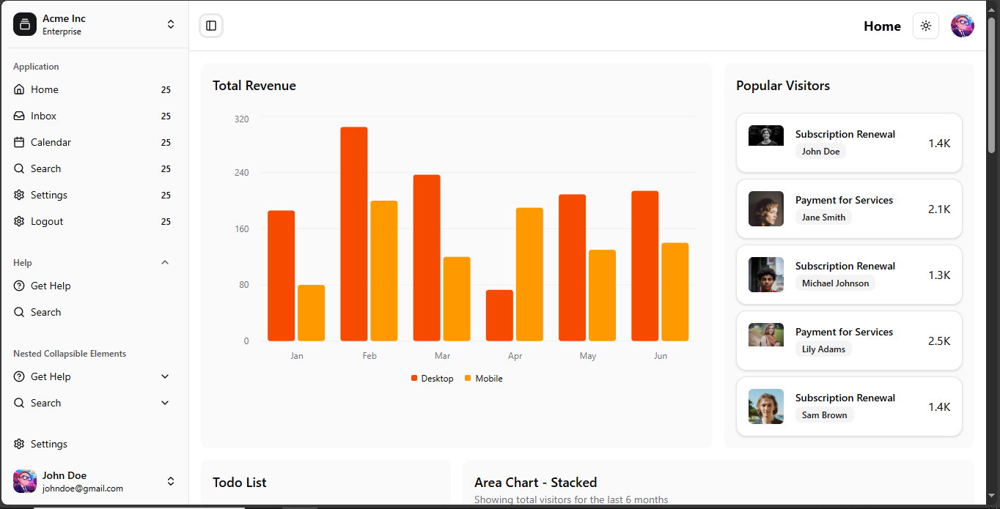
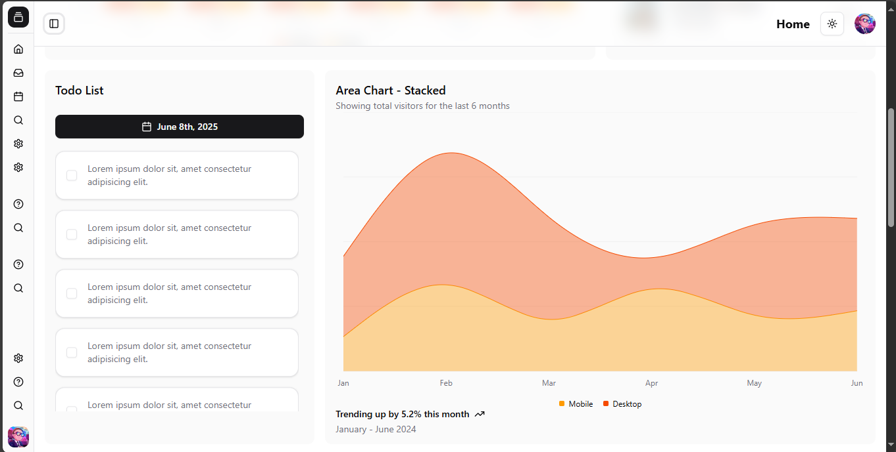
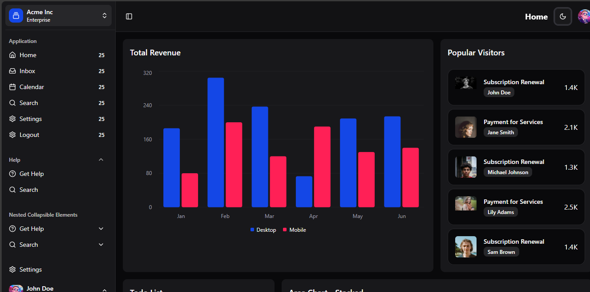
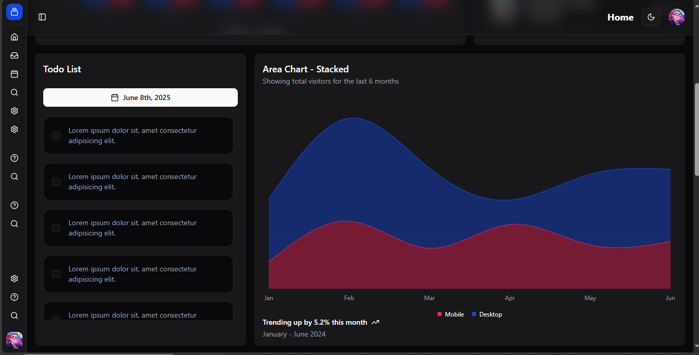

# 🧩 React Role-Based Dashboard Template

Un template moderne de dashboard React ⚡️ avec une authentification basée sur les rôles, navigation via **TanStack Router**, design élégant via **ShadCN/UI**, et support du **thème clair / sombre**. Idéal pour démarrer rapidement un projet pro ou une admin app !






## 🚀 Fonctionnalités

- 🔐 Authentification avec gestion des rôles (`admin`, `user`, etc.)
- 🔄 Routing ultra-rapide via **TanStack Router**
- 🎨 UI propre et moderne avec **ShadCN UI**
- 🌗 Thème clair / sombre avec sauvegarde dans `Cookie`
- 🧱 Architecture scalable et clean
- 🛠️ Prêt pour l'intégration d'une API backend
- 📱 Design responsive (mobile-first)
- ⚡ Performance optimisée avec code splitting
- 🎯 TypeScript pour une meilleure DX
- 🔍 Navigation breadcrumb automatique

---

## 🧪 Démo

> 👉 [Voir la démo](https://react-tanstack-dashboard-role-based-template-5o8u2uydb.vercel.app)

**Comptes de test :**

- **Admin :** `admin@example.com` / `admin123`
- **User :** `user@example.com` / `user123`

---

## 📦 Installation

```bash
# 1. Clone le repo
git clone https://github.com/CharlesLightjarvis/react-tanstack-dashboard-role-based-template.git

# 2. Va dans le dossier
cd react-tanstack-dashboard-role-based-template

# 3. Installe les dépendances
npm install

# 4. Lance le serveur de dev
npm run dev
```

Le serveur sera accessible sur [http://localhost:5173](http://localhost:5173)

---

## 🗂️ Structure du projet

```
react-tanstack-dashboard-role-based-template/
├── public/
│   ├── favicon.ico
│   └── vite.svg
├── src/
│   ├── components/
│   │   ├── ui/                     # Composants ShadCN UI
│   │   │   ├── button.tsx
│   │   │   ├── card.tsx
│   │   │   ├── input.tsx
│   │   │   └── ...
│   │   ├── layout/
│   │   │   ├── AppLayout.tsx       # Layout principal
│   │   │   ├── Sidebar.tsx         # Barre latérale
│   │   │   ├── Header.tsx          # En-tête
│   │   │   └── Breadcrumb.tsx      # Fil d'Ariane
│   │   ├── auth/
│   │   │   ├── LoginForm.tsx       # Formulaire de connexion
│   │   │   └── ProtectedRoute.tsx  # Route protégée
│   │   └── common/
│   │       ├── ThemeToggle.tsx     # Basculeur de thème
│   │       └── LoadingSpinner.tsx  # Spinner de chargement
│   ├── contexts/
│   │   ├── AuthContext.tsx         # Contexte d'authentification
│   │   └── ThemeContext.tsx        # Contexte de thème
│   ├── hooks/
│   │   ├── useAuth.ts              # Hook d'authentification
│   │   └── useTheme.ts             # Hook de thème
│   ├── lib/
│   │   ├── utils.ts                # Utilitaires généraux
│   │   └── auth.ts                 # Logique d'authentification
│   ├── routes/
│   │   ├── __root.tsx              # Route racine
│   │   ├── index.tsx               # Page d'accueil
│   │   ├── login.tsx               # Page de connexion
│   │   ├── dashboard/
│   │   │   ├── index.tsx           # Dashboard principal
│   │   │   ├── users.tsx           # Gestion des utilisateurs
│   │   │   ├── settings.tsx        # Paramètres
│   │   │   └── profile.tsx         # Profil utilisateur
│   │   └── admin/
│   │       ├── index.tsx           # Panel admin
│   │       └── analytics.tsx       # Analytiques
│   ├── types/
│   │   ├── auth.ts                 # Types d'authentification
│   │   └── user.ts                 # Types utilisateur
│   ├── styles/
│   │   └── globals.css             # Styles globaux
│   ├── App.tsx                     # Composant principal
│   ├── main.tsx                    # Point d'entrée
│   └── vite-env.d.ts              # Types Vite
├── docs/
│   └── screenshots/                # Captures d'écran
├── .env.example                    # Variables d'environnement exemple
├── .gitignore                      # Fichiers ignorés par Git
├── components.json                 # Configuration ShadCN
├── eslint.config.js               # Configuration ESLint
├── index.html                      # Template HTML
├── package.json                    # Dépendances NPM
├── postcss.config.js              # Configuration PostCSS
├── tailwind.config.js             # Configuration Tailwind
├── tsconfig.json                  # Configuration TypeScript
├── vite.config.ts                 # Configuration Vite
├── README.md                      # Ce fichier
└── LICENSE                        # Licence MIT
```

---

## ⚙️ Configuration

### Variables d'environnement

Créez un fichier `.env.local` à la racine du projet :

```env
# API Configuration
VITE_API_BASE_URL=http://localhost:3001/api
VITE_APP_NAME=Dashboard Template

# Auth Configuration
VITE_JWT_SECRET=your-super-secret-jwt-key
VITE_TOKEN_EXPIRE_TIME=24h

# Feature Flags
VITE_ENABLE_ANALYTICS=true
VITE_ENABLE_DEBUG_MODE=false
```

### ShadCN UI Configuration

Le projet utilise ShadCN UI avec la configuration suivante dans `components.json` :

```json
{
  "$schema": "https://ui.shadcn.com/schema.json",
  "style": "default",
  "rsc": false,
  "tsx": true,
  "tailwind": {
    "config": "tailwind.config.js",
    "css": "src/styles/globals.css",
    "baseColor": "slate",
    "cssVariables": true
  },
  "aliases": {
    "components": "@/components",
    "utils": "@/lib/utils"
  }
}
```

---

## 🛠️ Scripts disponibles

```bash
# Développement
npm run dev          # Lance le serveur de développement
npm run dev:host     # Lance avec accès réseau local

# Build
npm run build        # Construit l'application pour la production
npm run preview      # Prévisualise le build de production

# Qualité de code
npm run lint         # Vérifie le code avec ESLint
npm run lint:fix     # Corrige automatiquement les erreurs ESLint
npm run type-check   # Vérifie les types TypeScript

# Tests (à configurer)
npm run test         # Lance les tests unitaires
npm run test:watch   # Lance les tests en mode watch
npm run test:coverage # Génère le rapport de couverture

# Utilitaires
npm run clean        # Nettoie les fichiers de build
npm run analyze      # Analyse la taille du bundle
```

---

## 🧩 Stack technique

### Core

- **React** 18+ - Bibliothèque UI
- **TypeScript** - Typage statique
- **Vite** - Build tool et serveur de dev

### Routing & State

- **TanStack Router** - Routing type-safe
- **React Context** - Gestion d'état simple

### UI & Styling

- **ShadCN/UI** - Composants UI
- **Tailwind CSS** - Framework CSS utility-first
- **Lucide React** - Icônes modernes
- **class-variance-authority** - Variants de composants

### Dev Tools

- **ESLint** - Linting JavaScript/TypeScript
- **Prettier** - Formatage de code
- **PostCSS** - Traitement CSS

---

## 🔐 Système d'authentification

Le template inclus un système d'auth basique avec :

- **Rôles** : `admin`, `user`, `moderator`
- **Permissions** : Contrôle d'accès granulaire
- **Guards** : Protection des routes
- **Persistence** : Token JWT dans localStorage

### Exemple d'utilisation

```tsx
import { useAuth } from "@/hooks/useAuth";

function AdminPanel() {
  const { user, hasRole } = useAuth();

  if (!hasRole("admin")) {
    return <div>Accès refusé</div>;
  }

  return <div>Panel Admin</div>;
}
```

---

## 🎨 Système de thème

Le template supporte les thèmes clair/sombre avec :

- **Persistence** : Sauvegarde dans les cookies
- **Auto-detection** : Respect des préférences système
- **Variables CSS** : Personnalisation facile

### Personnaliser les couleurs

Modifiez `tailwind.config.js` :

```js
module.exports = {
  theme: {
    extend: {
      colors: {
        primary: {
          50: "#eff6ff",
          500: "#3b82f6",
          900: "#1e3a8a",
        },
      },
    },
  },
};
```

---

## 🚀 Déploiement

### Vercel (Recommandé)

```bash
# Installe Vercel CLI
npm i -g vercel

# Déploie
vercel
```

### Netlify

```bash
# Build
npm run build

# Déploie le dossier dist/
```

### Docker

```dockerfile
FROM node:18-alpine

WORKDIR /app
COPY package*.json ./
RUN npm ci --only=production

COPY . .
RUN npm run build

EXPOSE 3000
CMD ["npm", "run", "preview"]
```

---

## 🧪 Tests

Le template est configuré pour Jest et React Testing Library :

```bash
# Lance les tests
npm run test

# Tests avec couverture
npm run test:coverage

# Tests en mode watch
npm run test:watch
```

### Exemple de test

```tsx
import { render, screen } from "@testing-library/react";
import { LoginForm } from "@/components/auth/LoginForm";

test("renders login form", () => {
  render(<LoginForm />);
  expect(
    screen.getByRole("button", { name: /se connecter/i })
  ).toBeInTheDocument();
});
```

---

## 🤝 Contribution

Les contributions sont les bienvenues ! Voici comment procéder :

1. **Fork** le projet
2. Créez une **branche** pour votre feature (`git checkout -b feature/AmazingFeature`)
3. **Commit** vos changements (`git commit -m 'Add AmazingFeature'`)
4. **Push** vers la branche (`git push origin feature/AmazingFeature`)
5. Ouvrez une **Pull Request**

### Guidelines

- Respectez le style de code existant
- Ajoutez des tests pour les nouvelles features
- Mettez à jour la documentation si nécessaire
- Utilisez des commits conventionnels

---

## 📋 Roadmap

- [ ] 🔄 Intégration React Query pour le cache
- [ ] 🧪 Configuration complète des tests
- [ ] 📊 Dashboard analytics avancé
- [ ] 🌐 Internationalisation (i18n)
- [ ] 📱 PWA support
- [ ] 🔔 Système de notifications
- [ ] 📈 Graphiques et charts
- [ ] 🎯 Mode hors-ligne

---

## 📖 Ressources

- [TanStack Router Docs](https://tanstack.com/router)
- [ShadCN/UI Components](https://ui.shadcn.com/)
- [Tailwind CSS Docs](https://tailwindcss.com/docs)
- [React TypeScript Best Practices](https://react-typescript-cheatsheet.netlify.app/)

---

## 📄 Licence

Ce projet est sous licence **MIT**. Voir le fichier [LICENSE](LICENSE) pour plus de détails.

```
MIT License

Copyright (c) 2024 Charles Lightjarvis

Permission is hereby granted, free of charge, to any person obtaining a copy
of this software and associated documentation files (the "Software"), to deal
in the Software without restriction, including without limitation the rights
to use, copy, modify, merge, publish, distribute, sublicense, and/or sell
copies of the Software, and to permit persons to whom the Software is
furnished to do so, subject to the following conditions:

The above copyright notice and this permission notice shall be included in all
copies or substantial portions of the Software.

THE SOFTWARE IS PROVIDED "AS IS", WITHOUT WARRANTY OF ANY KIND, EXPRESS OR
IMPLIED, INCLUDING BUT NOT LIMITED TO THE WARRANTIES OF MERCHANTABILITY,
FITNESS FOR A PARTICULAR PURPOSE AND NONINFRINGEMENT. IN NO EVENT SHALL THE
AUTHORS OR COPYRIGHT HOLDERS BE LIABLE FOR ANY CLAIM, DAMAGES OR OTHER
LIABILITY, WHETHER IN AN ACTION OF CONTRACT, TORT OR OTHERWISE, ARISING FROM,
OUT OF OR IN CONNECTION WITH THE SOFTWARE OR THE USE OR OTHER DEALINGS IN THE
SOFTWARE.
```

---

## 👨‍💻 Auteur

**Charles Lightjarvis**

- GitHub: [@CharlesLightjarvis](https://github.com/CharlesLightjarvis)
- LinkedIn: [Charles Lightjarvis](https://linkedin.com/in/charles-lightjarvis)
- Email: charles.lightjarvis@example.com

---

## ⭐ Support

Si ce projet vous a aidé, n'hésitez pas à lui donner une ⭐ sur GitHub !

Pour toute question ou problème, ouvrez une [issue](https://github.com/CharlesLightjarvis/react-tanstack-dashboard-role-based-template/issues).

---

<div align="center">
  <p>Fait avec ❤️ pour la communauté React</p>
  <p>
    <a href="#top">⬆️ Retour en haut</a>
  </p>
</div>
