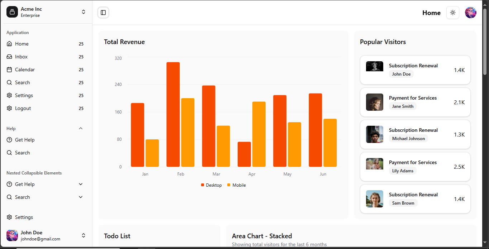
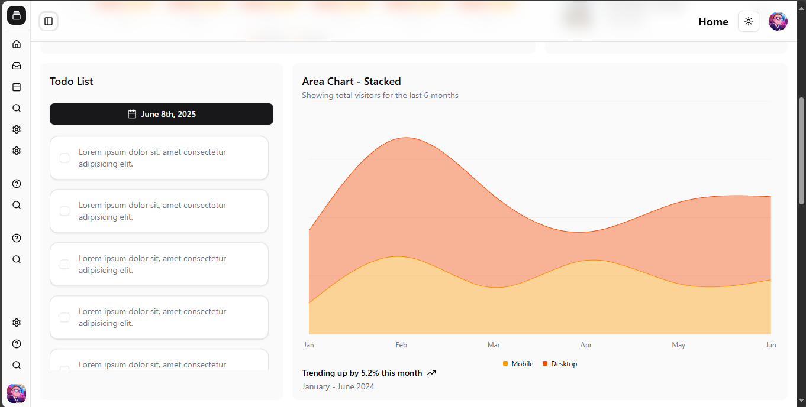
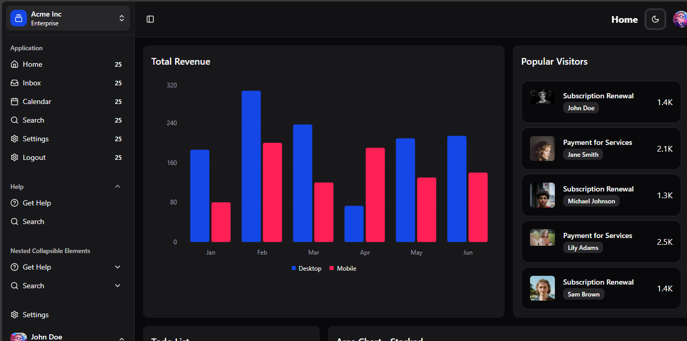
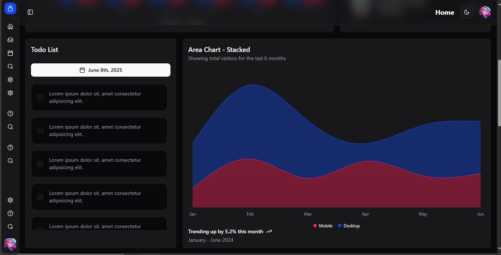

# 🧩 React Role-Based Dashboard Template

Un template moderne de dashboard React ⚡️ avec une authentification basée sur les rôles, navigation via **TanStack Router**, design élégant via **ShadCN/UI**, et support du **thème clair / sombre**. Idéal pour démarrer rapidement un projet pro ou une admin app !






## 🚀 Fonctionnalités

- 🔐 Authentification avec gestion des rôles (`admin`, `user`, etc.)
- 🔄 Routing ultra-rapide via **TanStack Router**
- 🎨 UI propre et moderne avec **ShadCN UI**
- 🌗 Thème clair / sombre avec sauvegarde dans `Cookie`
- 🧱 Architecture scalable et clean
- 🛠️ Prêt pour l’intégration d’une API backend

---

## 🧪 Démo

> _(Ajoute ici un lien vers une démo si tu en as une sur Vercel ou Netlify)_  
> 👉 [Voir la démo](https://example.vercel.app)

---

## 📦 Installation

```bash
# 1. Clone le repo
git clone https://github.com/CharlesLightjarvis/react-tanstack-dashboard-role-based-template.git

# 2. Va dans le dossier
cd react-tanstack-dashboard-role-based-template

# 3. Installe les dépendances
npm install

# 4. Lance le serveur de dev
npm run dev
```
